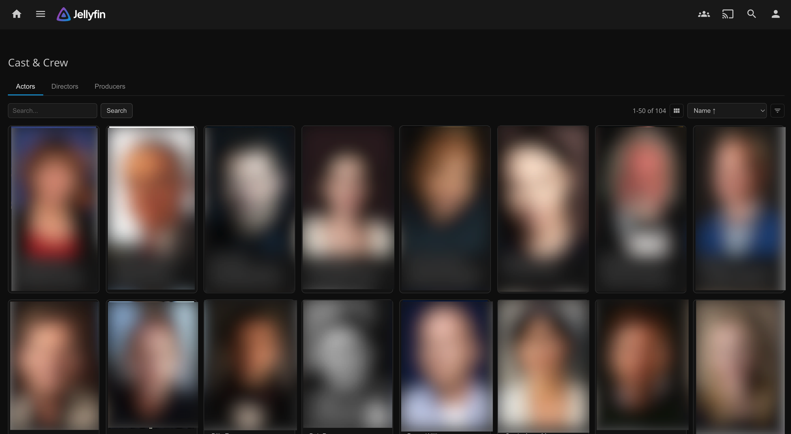

# Jellyfin-Plugin-CastCrew

A Jellyfin plugin that adds a **Cast & Crew** page to the sidebar for browsing actors, directors, and producers with search, sorting, pagination, and person detail navigation.

## Screenshots



<details>
<summary>Navigation Demo (GIF)</summary>


</details>

## Installation

### From Plugin Repository (recommended)

1. In Jellyfin, go to **Dashboard → Plugins → Repositories**.
2. Add a new repository:
   - **Name:** `CastCrew`
   - **URL:** `https://zieng.github.io/Jellyfin-Plugin-CastCrew/manifest.json`
3. Go to **Catalog**, find **CastCrew**, and click **Install**.
4. Restart Jellyfin.

Jellyfin will automatically select the correct version for your server (10.10.x or 10.11.x).
The plugin repository manifest keeps historical releases, so previous CastCrew versions remain visible in Jellyfin's plugin catalog.

### Manual Installation

1. Download the correct zip from [Releases](https://github.com/Zieng/Jellyfin-Plugin-CastCrew/releases):
   - `CastCrew_<version>_jellyfin-10.10.zip` for Jellyfin 10.10.x
   - `CastCrew_<version>_jellyfin-10.11.zip` for Jellyfin 10.11.x
2. Extract into your Jellyfin plugins directory (e.g., `<data>/plugins/CastCrew_<version>/`).
3. Restart Jellyfin.

## Features

- **Sidebar entry** — "Cast & Crew" appears in Jellyfin's left navigation drawer
- **Role tabs** — Switch between Actors, Directors, and Producers
- **Search** — Filter by name with grouped name/description matches
- **Sort & Filter** — Sort by Name, DateCreated, or Random; filter by favorites, tags, or country/region
- **Library filter** — Narrow Cast & Crew results to a specific included library (default: all included libraries)
- **Library-scoped people** — Optionally include specific libraries and show only cast/crew that appear in those libraries
- **Pagination** — Browse large libraries without performance issues
- **Person detail** — Click any person to open their native Jellyfin detail page
- **Quick settings** — Gear shortcut in the Cast & Crew page header opens CastCrew settings directly
- **Sync controls** — Header shows latest person-library sync time and provides a manual refresh button
- **Multi-language** — UI strings available in English and Chinese

## Configuration

Go to **Dashboard → Plugins → CastCrew** to configure:

| Setting | Default | Description |
|---------|---------|-------------|
| Page Size | 50 | Number of persons per page (10–200) |
| Sort By | Name | Default sort mode (Name or DateCreated) |
| Main Menu Entry | Enabled | Show/hide Cast&Crew in sidebar |
| Debug Logging | Disabled | Enable verbose CastCrew logs for plugin debug. |
| Route Preference | Auto | Person detail navigation mode (Auto, HashBang, Hash) |
| Included Libraries | All libraries | Restrict Cast & Crew results to people that appear in movies from selected libraries |

Library-person mapping refreshes automatically after saving settings and when library content changes. The Cast & Crew page header also includes a manual refresh button and displays the latest sync timestamp.
If mapping sync is still pending, Cast & Crew results still load immediately and library scoping is applied after the sync finishes.

## Compatibility

| Platform | Support |
|----------|---------|
| Jellyfin 10.10.x (net8.0) | ✅ |
| Jellyfin 10.11.x (net9.0) | ✅ |
| Docker (linuxserver, official) | ✅ Works out of the box |
| Windows installer | ✅ Auto-bootstraps writable web dir |
| macOS app bundle | ⚠️ Requires writable `--webdir` |
| Native mobile clients | ❌ Web-only (API endpoints still available) |

### Docker

The plugin works automatically in Docker containers with read-only web roots. No additional configuration is needed — the sidebar entry is injected at the HTTP response level without modifying any files on disk.

### Windows Installer

On Windows installs where the web root (`Program Files`) is read-only, CastCrew automatically:
1. Copies web assets to `%LOCALAPPDATA%\Jellyfin\custom-web`
2. Sets user-level `JELLYFIN_WEB_DIR` environment variable
3. Refreshes the Jellyfin tray launcher

Restart Jellyfin once after first install to activate.

### macOS App Bundle

Run Jellyfin with a writable web directory:
```
jellyfin --webdir "$HOME/Library/Application Support/jellyfin/custom-web"
```

## Limitations

- CastCrew UI is rendered inside Jellyfin Web only. Native mobile clients (iOS/Android apps) that don't embed the web UI won't show the sidebar entry.
- The CastCrew API endpoints (`/CastCrew/Actors`, `/CastCrew/Directors`, `/CastCrew/Producers`) remain available on all platforms regardless of UI visibility.

## Development

## Troubleshooting

### No Cast&Crew in sidebar

Open the page in a **private/incognito window**. If it appears there, your browser has cached stale data — do a hard refresh (Ctrl+Shift+R / Cmd+Shift+R) in your normal browser.

> **Tip:** If you're unsure whether the plugin is working, try opening Jellyfin in a private/incognito browser window first. This bypasses all browser caches and gives you a clean test.

## Development

For architecture details, build commands, API contracts, project structure, and contribution guidance, see **[DESIGN.md](DESIGN.md)**.
